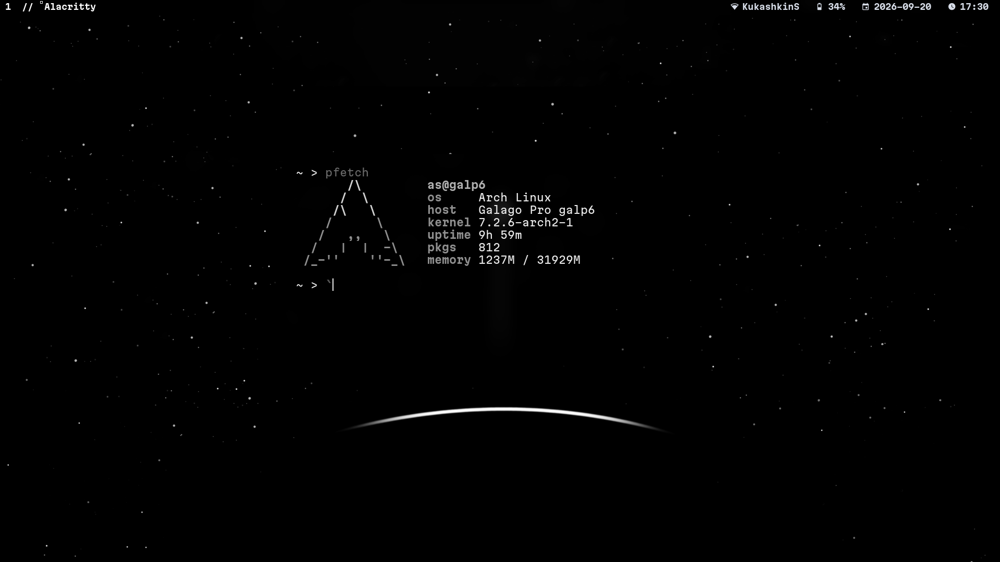

# Build Instructions

Note: Currently I only have the install script for ArchLinux.

1. Clone github repository, having git installed on your system.
   ```bash
   git clone https://github.com/Invader788/archive
   ```

2. CD into the archive/ArchLinux directory.
   ```bash
   cd archive/ArchLinux
   ```

3. Make the install script executable and start the installation
   ```bash
   chmod +x install.sh
   ./install
   ```

# Manual Build Instructions

1. Clone github repository, make sure you have git installed on your system.
```bash
git clone https://github.com/Invader788/archive
```
2. Open the folder labeled "archive" in the same directory you cloned the repository.
```
cd archive
```
3. Once inside the "archive" directory navigate to the "ArchLinux" or "BSD" folders
  based on the type of system you have, this project will work best on ArchLinux and BSD systems,
  I will be adding more support in the future.

4. Install dependencies:

   BSD
```BSD

sudo pkg update
sudo pkg upgrade


sudo pkg install -y \
    harfbuzz \
    libXinerama \
    libXft \
    gmake \
    base-devel \
    xorg-server \
    xinit \
    neovim \
    nerd-fonts-martianmono \
    p7zip \
    thunar-archive-plugin \
    engrampa \
    zsh \
    zsh-autosuggestions \
    zsh-syntax-highlighting \
    feh
    firefox
```
ArchLinux
```
sudo pacman -Syu --noconfirm

sudo pacman -S --needed --noconfirm \
    base-devel \
    git \
    harfbuzz \
    libxinerama \
    libxft \
    xorg-server \
    xorg-xinit \
    neovim \
    zsh \
    zsh-autosuggestions \
    zsh-syntax-highlighting \
    feh \
    picom \
    thunar \
    thunar-archive-plugin \
    engrampa \
    p7zip \
    ttf-martian-mono-nerd
```
5. Compile!

  ArchLinux 
   ```
   cd dwm
   sudo make clean install
   cd ..
   cd dwmblocks
   sudo make clean install
   cd ..
   cd dmenu
   sudo make clean install
   cd
   ```
  BSD
   ```
   cd dwm
   sudo gmake clean install
   cd ..
   cd dwmblocks
   sudo gmake clean install
   cd ..
   cd dmenu
   sudo gmake clean install
   cd
   ```
6. Create a .xinitrc file, you can either make one on your own or there is a
   pre-made .xinitrc file in the repo both in the BSD and ArchLinux folders.

   there are some things your are going to want to change in my .xinitrc file before
   using, 1. GTK/QT dark-light themes, 2. wallpapers, I am using feh to set my wallpaper and it has a
   set directory for my computer, if you want to use a wallpaper then add the directory for your image.

# Keyboard Shortcuts
Open Terminal window (meta + t),
Open Browser window (meta + b),
Open File browser window (meta + f),
Open dmenu (meta + d),
Change window layout to master-stack (meta + s),
Change window layout to dwindle (meta + w),
Change window layout to Fibonacci sequence (meta + a),
Change window layout to floating (meta + e),
Swap window to master (meta + r),
Push window(s) to the right (meta + l),
Push window(s) to the left (meta + h),
exit X (meta + shift + q),

# Version Info 

Change log:

v1.24 alpha

New theming features!

Right Now using the new switch.sh
that switches the terminal color-scheme and background 
(Note this is an alpha release and will be compatible with any wallpaper)
right now I only have a test theme that I'm using for my wallpaper (in the github)
and a darktheme that I made.

In the full release there will be support for any wallpaper with python-pywal that will create the colorscheme 
and then the script adds the colorscheme into dwm and terminal (alacritty).


# Legal
License Note: The suckless software configurations are released under the MIT/X11 license. 


## Screenshots





# Contact

email:
Space_Invader788@proton.me

Thanks to TheRealBrodie for helping out with the new install script!
