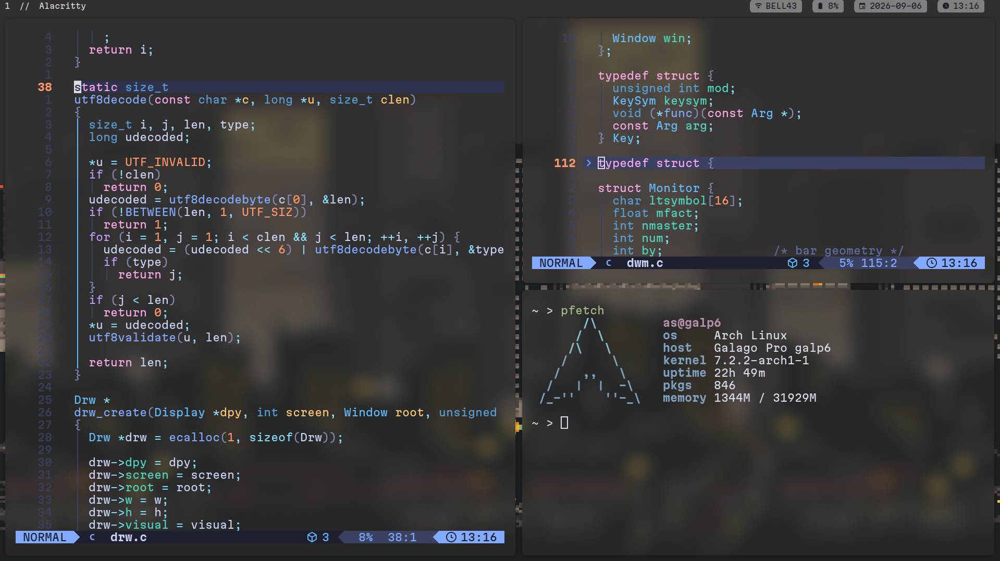

# dwm 
A simple customizable window manager I use

# dmenu & dwmblocks
I use dmenu and dwmblocks alongside dwm, 
dmenu - open apps 
dwmblocks - provide time, date, battery, and network information

# Compatibility
Although I have only used this dwm configuration on ArchLinux and FreeBSD
it will probably work on different Operating systems as well.

# Legal
License Note: The suckless software configurations are released under the MIT/X11 license. 

## Demo

# Build Instructions
To reproduce this environment, ensure you have the Xlib development headers installed, then clone and compile:

Bash

git clone https://github.com/Invader788/archive

# Contact

contact:

Space_Invader788@proton.me
